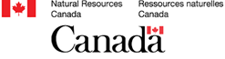
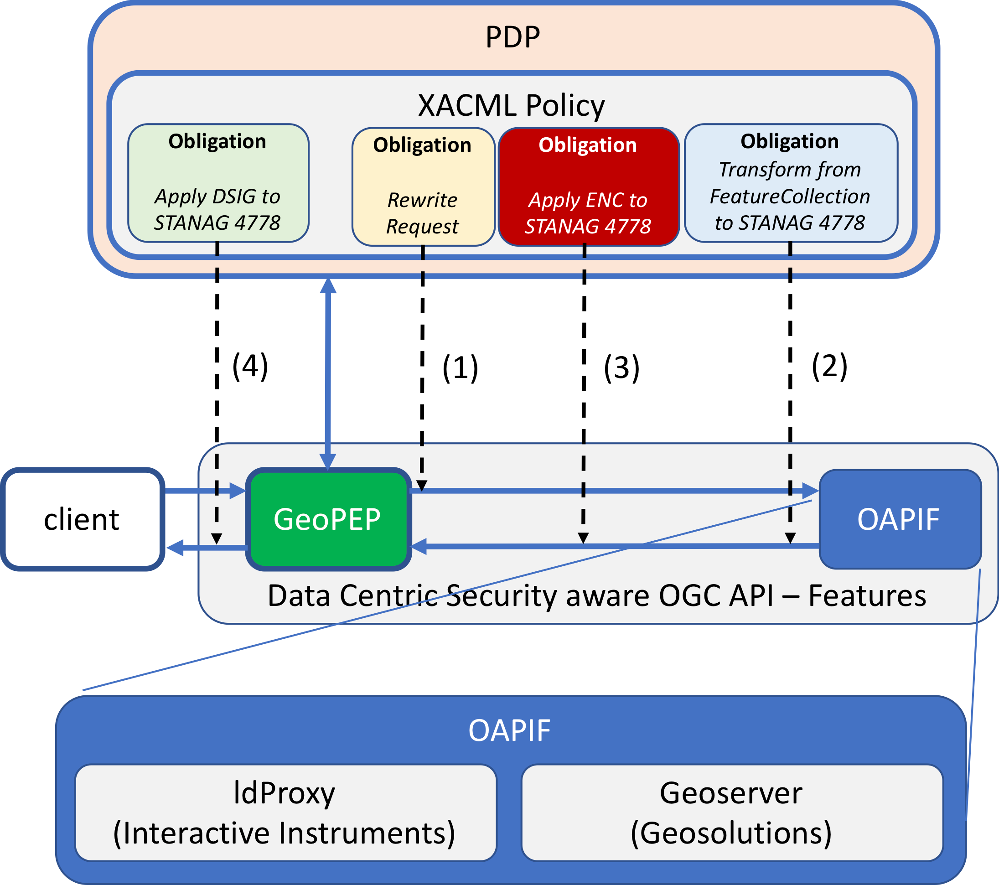
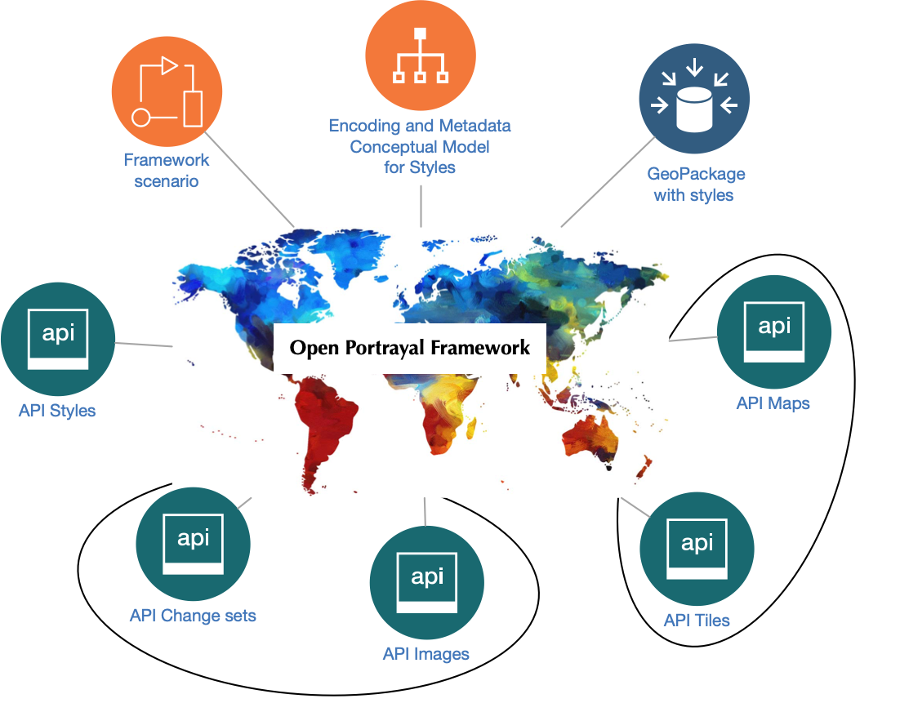
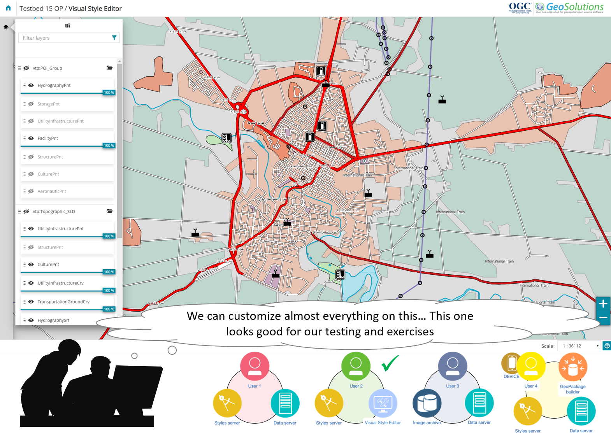
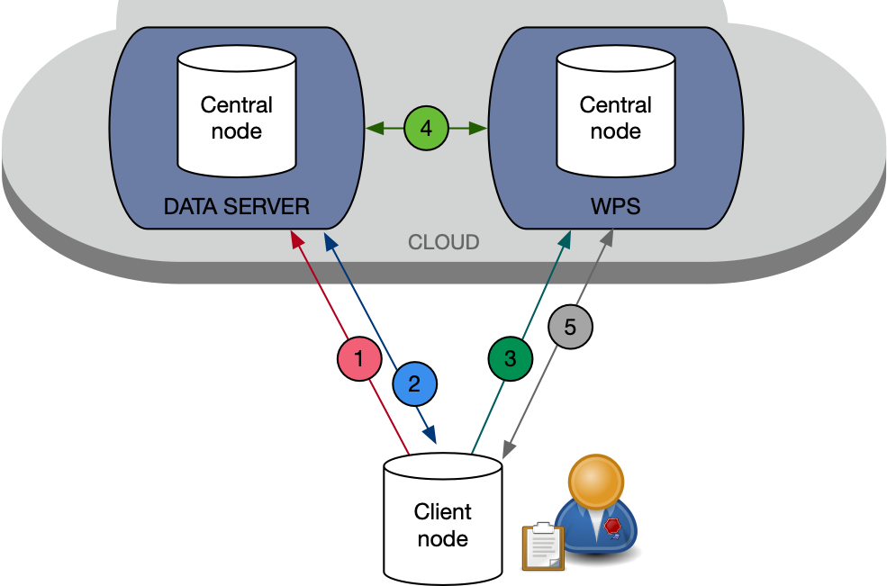

[[AllTogether]]

[[Overview]]

= Innovating Geospatial Data Processing, Analysis, and Visualization

Sponsoring organisations once again defined geospatial IT interoperability and/or technology requirements in OGC’s 15th annual major testbed, following the proven and well established testbed process: The sponsors' real world requirements were integrated into a set of software architectures by OGC Staff and the combined requirements were documented and released as an OGC Call for Participation (CFP). Technology providers respond to the CFP and selected organizations receive support and funding to collaboratively research and rapidly develop prototype solutions. Eventually, the results of the Testbed activity are submitted to the OGC Standards Program to be considered as input into ongoing OGC consensus-based standards and best practices work. Testbed-15 addressed six main topics (<<thread-summaries,Threads>>) as illustrated in the figure below:

image::images/testbed15-overview.png[width=800,align="center"]

The following was the primary research goal for each thread:

- The <<EOPAD,Earth Observation>> thread focused on developing a data model and an associated catalogue interface to support Earth Observation (EO) application and process discovery.
- The <<DataCentricSecurity,Data Centric Security>> thread researched the current state of security in protecting data in a geospatial environment using encrypted containers.
- The <<FCA,Federated Cloud Analytics>> thread researched how emerging technologies and architectures featuring distributed cloud environments can be successfully integrated with OGC Open Web Services.
- The <<DeltaUpdates,Delta Updates>> thread explored how changes (updates) to geospatial data can be securely provided to users in the field, especially in a Denied, Disrupted, Intermittent, and Limited (bandwidth) situation.
- The <<OPF,Open Portrayal Framework>> thread defined models, APIs, and an architecture to support and enable open and interoperable portrayal of geospatial content.
- The <<MachineLearning,Machine Learning>> thread explored how machine learning models and their outputs could be integrated with OGC Open Web Services.

= Impacts on OGC Standards Work and the Future

Testbed 15 work resulted in:

* Sixteen Engineering Reports presented to the Members and approved for https://www.opengeospatial.org/docs/er[public release].
* The various API prototype activities provided detailed input into the https://github.com/opengeospatial/oapi_common[OGC API-Common draft specification] supporting the release of this document as a draft OGC standard.
* Submission of a formal proposal to form a Styles API Standards Working Group to continue development of the OGC API-Styles with the intent to have that API approved as an official OGC standard.[yellow-background]*if already available, a link to the charter doc / WG landing page would be good*
* Detailed technical and requirements input into the new https://www.opengeospatial.org/projects/groups/apirecordsswg[OGC API-Records] (Formerly Catalog) Standards Working Group.
* Proposals for extensions/enhancements to the OGC GeoPackage Standard: Extensions related to tiled feature data, extensions to encode portrayal information (styles and symbols), proposal for Metadata and Application Profiles, and an extension to support semantic annotations.

= Future Steps

The next major OGC Initiative, Testbed-16, runs April to December 2020, with testbed results to be reported as part of the OGC Technical Committee meetings in September and December 2020.

[[Testbed15Facts]]

= Testbed 15 Facts

[big red yellow-background]*Research and Rapid Prototyping with the goal of enhancing and extending the OGC Standards Baseline to meet Community requirements.*

In OGC’s annual testbeds, sponsoring organisations specify interoperability requirements to address both their needs as well as gaps in the https://www.opengeospatial.org/standards[OGC Standards Baseline]. OGC staff integrate these requirements into a formal https://www.opengeospatial.org/pressroom/pressreleases/2927[Call for Participation (CFP)]. Technology providers, also known as participants, then receive cost-share support and funding to collaboratively research and rapidly develop prototype solutions. When the testbed is completed, the results are documented in https://www.opengeospatial.org/docs/er[OGC Engineering Reports]. The Engineering Reports may specify change requests to existing OGC standards, extensions to an existing standard, or even a new draft specification. These are submitted to the OGC Standards Program for discussion, consideration, and eventually Member approved consensus-based open standards and best practices.

[[Facts]]

=== Facts

The following are key facts about the OGC Testbed 15 activity.

* <<Sponsoring,8 Sponsoring Member organizations>>
* 30 Representatives from the 8 Sponsoring Organizations
* 66 Active individual particpants from <<Participating,22 Member Organizations>>.
* 113 Observers representing 72 Member Organizations.
* 16 <<ER_Overview,Engineering Reports>> written and approved for public release

Testbed-15 commenced with a Kickoff Workshop in early April, 2019, hosted by the USGS at their Reston Virgina facility. The Testbed activity culminated with presentations and short demonstrations at the November 2019 Technical Committee meetings in Toulouse France.

[[Threads]]

=== Testbed 15 Key Work Activities (Threads)

The Testbed is organized in a number of threads. Each thread combines a number of tasks that are further defined in the Call for Participation. The threads integrate both an architectural and a thematic view, which allows keeping related work items close together and removing dependencies across threads. Click on the link if you want to read the detailed description of a Thread as provided in the CFP. In addition, short overviews are provided <<thread-summaries,here>>.

* Thread 1: Secure Data and Federated Clouds (SFC)
** https://portal.opengeospatial.org/files/?artifact_id=82290#DataCentricSecurity[Data Centric Security]
** https://portal.opengeospatial.org/files/?artifact_id=82290#FederatedCloudAnalytics[Federated Cloud Analytics]
* Thread 2: Cloud Processing and Portrayal (CPP)
** https://portal.opengeospatial.org/files/?artifact_id=82290#EOPAD[Earth Observation Process and Application Discovery]
** https://portal.opengeospatial.org/files/?artifact_id=82290#Portrayal[Open Portrayal Framework]
* Thread 3: Machine Learning and Delta Updates (MLD)
** https://portal.opengeospatial.org/files/?artifact_id=82290#MachineLearning[Machine Learning]
** https://portal.opengeospatial.org/files/?artifact_id=82290#DeltaUpdates[Delta Updates]

[[Demonstrations]]

=== Online Demonstrations

In addition to the Engineering Reports, the participants developed a suite of videos that showcase the results of the work done. The videos are available on the https://www.youtube.com/channel/UCR5YGb1pVBBFV-XNA6mA0gg[Open Geospatial YouTube channel]. If you navigate to the OGC YouTube channel, then click on the Testbed 15 playlist. Also take the opportunity to view other videos that document a variety of OGC Interoperability Initiatives.

[[Sponsoring]]

=== Sponsoring Organizations

The following OGC Member organizations and others sponsored OGC Testbed 15. The sponsors provided interoperability requirements, use cases, and scenarios. The also provided cost share funding as well as geospatial data as required to run the scenarios.

|===
|image:images/dstl-logo.png[width=60,height=50]  | https://www.gov.uk/government/organisations/defence-science-and-technology-laboratory[Defence Science and Technology Laboratory (Dstl)]
|  | https://www.esa.int/[European Space Agency (ESA)]
| | https://www.satcen.europa.eu/[European Union Satellite Centre (SatCen)]
|| https://www.nrcan.gc.ca/[Natural Resources Canada (NRCan)]
| | https://www.usgs.gov/[US Geological Survey (USGS)]
| | https://www.nasa.gov/[US National Aeronautics and Space Administration (NASA)]
|===

[[Participating]]

=== Participating Organizations

The following organizations were selected as official Testbed 15 participants. Each particpating organization had specific deliverables and tasks based on their responses to the Call for Participation.

|===
|http://www.52north.org/[52 North]             | Germany
|http://www.asu.edu/[Arizona Board of Regents] | US
|http://www.compusult.net/[Compusult]          | Canada
|http://www.crim.ca/[CRIM]                     | Canada
|http://www.cubewerx.com/[CubeWerx]            | Canada
|http://www.elecnor-deimos.com/[Deimos Space]  | Spain
|http://www.digitalglobe.com/[DigitalGlobe]    | US
|http://ecere.ca/[Ecere]                       | Canada
|http://frisia-it.com/[Frisia IT]              | Germany
|http://www.geo-solutions.it/[GeoSolutions]    | Italy
|http://csiss.gmu.edu/[CSISS George Mason University] | US
|http://www.helyx.co.uk/[Helyx Ltd.]           | UK
|http://www.imagemattersllc.com/[Image Matters] | US
|http://www.interactive-instruments.de/[interactive instruments] | Germany
|http://www.rasdaman.com/[rasdaman]            | Germany
|http://www.rheagroup.com/[RHEA Group]         | Belgium
|http://www.secure-dimensions.de/[Secure Dimensions] |Germany
|http://www.skymantics.com/[Skymantics]        | US
|http://www.solenix.ch/[Solenix Deutschland]   | Germany
|http://www.spacebel.be/[Spacebel]             | Belgium
|http://www.terradue.com/[Terradue]            |Italy
|http://www.creaf.uab.es/miramon[UAB-CREAF]    |Spain
|===

[[thread-summaries]]

== Thread Summaries

The major activities of the six Testbed 15 Threads are summarized in the following sections.

[[SFC]]

=== Thread 1: Secure Data and Federated Clouds (SFC)

[[DataCentricSecurity]]

==== Data Centric Security

*Explore How Data Centric Security principals can be applied at the feature level in a geospatial data store.*

Data-centric security emphasizes the security of the data itself rather than the security of networks, servers, or applications. In Testbed-15, the focus was on how security works at a Feature Level and what implications this has on the network in terms of additional data burden. With a focus on actual interactions and general workflows, Testbed-15 work sought to answer the question of how data centric security can be applied to OGC standards based architectures:

* How does data centric security work with OGC standards and best practices?
* Which elements are already supported and how?
* Which modifications to existing OGC standards or best practices are necessary to exploit the full potential of data centric security?

To answer these questions, the Testbed particpants examined the use of encrypted containers in combination with geospatial data using the encoding for an http://docs.opengeospatial.org/is/17-069r3/17-069r3.html[OGC API - Features] and the Web Feature Service (WFS) FeatureCollection structure. Within that context, the particants looked at the use of encrypted container formats such as https://nso.nato.int/nso/zPublic/ap/PROM/ADatP-4778%20EDA%20V1%20E.pdf[NATO STANAG 4778] "Information on standard Metadata Binding" with metadata as defined in https://nso.nato.int/nso/zPublic/ap/PROM/ADatP-4774%20EDA%20V1%20E.pdf[NATO STANAG 4774] "Confidentiality Metadata Label Syntax" to permit the sharing of sensitive information between allies.

*Geospatial Policy Enforcement Point (GeoPEP) as a Proxy for STANAG 4778*

In general, the work performed in Testbed 15 demonstrated that with a security proxy and an http://docs.opengeospatial.org/is/17-069r3/17-069r3.html[OGC API - Features] service, an implementation can satisfy the requirements for a data centric security model. The http://docs.opengeospatial.org/per/19-016r1.html[OGC Data Centric Security Engineering Report documents the results of implementing three data centric scenarios. Two of the scenarios verified that there are backward compatible methods for implementing data centric security.

The following are additional information resources regarding the Data Centric Security task.

[options="header"]
|===
| Information Resource | Location of resource
| Requirements | https://portal.opengeospatial.org/files/?artifact_id=82290#DataCentricSecurity[CFP Sponsor Requirements for Data Centric Security]
| Engineering Report |http://docs.opengeospatial.org/per/19-016r1.html[Data Centric Security Engineering Report]
| Power Point Presentation | link:https://github.com/cnreediii/testbed15-summary/blob/master/slides/Testbed%2015%20Data%20Centric%20Security.pdf[Slide presentation]
| Short Video | link:https://www.youtube.com/watch?v=5_ynVa8ZMY4&list=PLQsQNjNIDU85HBDZWc8aE7EvQKE5nIedK&index=7&t=0s[Youtube Video]
|===

[[FCA]]

==== Federated Cloud Analytics

*Research how emerging technologies and architectures featuring distributed cloud environments can be successfully integrated with OGC standards*

The advent of the cloud computing era has fundamentally changed how people and organizations view computing — and more specifically how people and organizations interact with the resources that they care about: data and services. All computing resources, including clouds, exist in some type of administrative domain wherein access management can be done. As long as resources are all in the same administrative domain, managing access is straight-forward. However, with the continued development of our interconnected world, it is becoming increasingly common that data and services desired by a user exist across different administrative domains.

Easily accessing resources distributed across different administrative domains is a challenge. The naive approach is for an individual to maintain n1 different accounts and credentials for n2 different organizations. A more effective approach is federation.

Simply put, a federation enables a set of participating organizations to selectively share data and resources for specific purposes. The goal is to make federated environments as seamless, transparent, and easy to use as a single centralized environment. More precisely, a federation is a security and collaboration context wherein participants can define, agree up on, and enforce joint resource discovery and access policies.

Previous OGC Testbeds addressed a number of issues related to supporting analytic workflows where the data and analytics are hosted or deployed in an ad-hoc manner on multiple heterogeneous clouds that belong to different administrative domains. In this Testbed activity the OGC began to assess the sufficiency of that body of work and identify areas were additional work is needed. This assessment was performed through a proof of concept executing a non-trivial analytic mission leveraging data and analytics hosted on two or more clouds.

Of particular interest in this context are three aspects. Firstly, the handling of security in federations. Second, how the Testbed-13 and Testbed-14 research results of "bringing applications to the data" relate to SCALE and SEED. SCALE is an open source system that provides management and scheduling of automated processing on a cluster of machines. SCALE uses the SEED specification to aid in the discovery and consumption of processes packaged in a Docker containers. Third, the role of blockchain and distributed ledger technologies in the context of handling provenance in federations.

To meet this objective, this task was organized in four separate sub-tasks. The following research questions were addressed by the particpants:

* Federated Security: Can the https://www.nist.gov/system/files/documents/2019/07/09/nist_cfra_20190709_draft_v1.0.pdf[NIST/IEEE Federated Cloud Architecture] be validated (or invalidated) in a typical federated clouds analytics scenario that includes separate cloud environments? How can the Mediation Server concept developed in Testbed-14 be further enhanced to a fully functional Federation Manager in the sense of NIST/IEEE? What are the advantages and disadvantages, and how does this extended functionality fit within the OGC family of standards?
* Federated Cloud Analytics: How to bring SCALE and SEED into the family of cloud architectures supported by OGC standards? What role does the OGC WPS Standard play? What catalog solutions work best?
* EOC, SCALE, and SEED: How to handle the different approaches for cloud processing? Where are harmonization opportunities, what needs to remain separate?
* Federated Clouds Provenance: How can Blockchain and distributed ledger technologies be used to protect the integrity of different types of provenance data?

The results of each of these work activities are described in the Thread Engineering Reports as well as the additional material below:

[options="header"]
|===
| Information Resource | Location of resource
| Requirements | https://portal.opengeospatial.org/files/?artifact_id=82290#FederatedCloudAnalytics[CFP Sponsor Requirements for Federated Cloud Analytics]
| Engineering Reports | http://docs.opengeospatial.org/per/19-024r1.html[Federated Clouds Security Engineering Report] +
      http://docs.opengeospatial.org/per/19-026.html[Federated Clouds Analytics Engineering Report] +
      http://docs.opengeospatial.org/per/19-022r1.html[Scaling Units of Work (EOC, Scale, SEED) Engineering Report] +
      http://docs.opengeospatial.org/per/19-015.html[Federated Cloud Provenance Engineering Report]
| Power Point Presentation | link:https://github.com/cnreediii/testbed15-summary/blob/master/slides/Testbed%2015%20Federated%20Cloud%20analytics.pdf[Slide presentation]
| Short Video | link:https://portal.opengeospatial.org/files/?artifact_id=91766[OGC Video]
|===

[[CPP]]

=== Thread 2: Cloud Processing and Portrayal (CPP)

[[EOPAD]]

==== Earth Observation Process and Application Discovery

*Researching approaches for users to discover and run the Earth Observation applications they need.*

Over the last decade, several platforms have emerged that provide access to Earth Observation data and processing capacities. These platforms host very large (petabyte) datasets. As such, a paradigm shift from data download and local processing towards application upload and processing close to the physical location of the data is now critical. To interpret peta- or exascale scientific data, capabilities of these platforms need to be combined in future.

Hence, the focus of Testbed-15 work was to define the building blocks through which such applications and related services can be exposed through a Catalogue service. Within that overarching goal, the Testbed particpants described and demonstrated how OGC standards can be used or need to be extended to provide for discovery and use of EO data processing applications that can be deployed and executed by the user or are already deployed and available behind standardized OGC interfaces. The participants also demonstrated how existing and emerging systems - as deployed by NASA (e.g. NASA DAACs and NASA DASS), ESA (ESA TEPs) or systems that have already integrated various nodes such as the Earth System Grid Federation (ESGF) - can be federated to allow for cross-platform analysis and visualization of data.

The results of this work, documented in the Engineering Report, define the building blocks through which such applications and related services can be exposed through a Catalogue service, including:

* A Data model
* Service interfaces
* A Service management interface

The key findings from the work include:

* The bindings for the proposed Catalogue and GeoJSON Data Model are consistent with existing OGC Standards related to OWS Context and OGC Extensions of OpenSearch.
* Support for facet discovery and faceted search responses was borrowed from existing OASIS SRU specifications and the http://docs.opengeospatial.org/per/19-020r1.html#SRU-Extension[SRU extension of OpenSearch].
* The proposed Data Model relies on OGC OWS Context [OGC14-055r2] Offerings to describe service or application access mechanisms and endpoints.
* In addition to the GeoJSON-based model, the corresponding JSON-LD representation is proposed as well in this ER. A service or application described in the catalog is modelled as a dcat:DataService in [DCAT-2].

The results of the Data Centric Security task activities as well as supporting information are provided in the following resources:

[options="header"]
|===
| Information Resource | Location of resource
| Requirements | https://portal.opengeospatial.org/files/?artifact_id=82290#EOPAD[CFP Sponsor Requirements for Earth Observation Process and Application Discovery]
| Engineering Report(s) |http://docs.opengeospatial.org/per/19-020r1.html[Catalogue and Discovery Engineering Report]
| Power Point Presentation | link:https://github.com/cnreediii/testbed15-summary/blob/master/slides/Testbed%2015%20Earth%20Observation%20Task.pdf[Slide presentation]
|===

[[OPF]]

==== Open Portrayal Framework

*Define the Models, APIs, and Architecture to Support and enable Open and Interoperable Portrayal.*

Interoperable, dynamic portrayal of maps and related geospatial data is still challenging when working across multiple computing, rendering, communications and display environments.  Despite previous efforts, the OGC is still missing a robust conceptual model and related APIs capable of supporting multiple style encodings and the style encodings themselves.

Therefore, the primary topics addressed in the OPF Thread covered supporting style sharing and updates, client- and server-side rendering of both vector- and raster data, and converting styles from one encoding to another. This work was based on a draft http://www.opengis.net/doc/PER/t15-D011[conceptual style model]. In addition, there was a requirement to render data according to style definitions in a denied, disrupted, intermittent, and limited bandwidth (DDIL) infrastructure.

*Overview of the Testbed-15 Open Portrayal Framework major work items*

The goal of the Testbed-15 Open Portrayal Framework thread was to implement a data discovery, access, and styled rendering scenario. The scenario was based on a simulated humanitarian relief effort in Daraa, Syria area. The simulated scenario requied multiple partners to share information quickly and seamlessly via a Common Operational Picture. To promote this 'common picture', simple maps with styles for day or night operations must be rapidly customized and shared between partnering organizations from many nations. The most recent satellite imagery for the Daraa, Syria, area was also added to the 'common picture', as illustrated below. The scenario also included requirements for data updates performed as a background tasks and support for online/offline functionality.

*Result of applying knowledge and draft APIs developed in the OPF Thread*

[options="header"]
|===
| Information Resource | Location of resource
| Requirements | https://portal.opengeospatial.org/files/?artifact_id=82290#Portrayal[CFP Sponsor Requirements for Open Portrayal Framework]
| Engineering Reports | http://docs.opengeospatial.org/per/19-023r1.html[Encoding and Metadata Conceptual Model for Styles Engineering Report] +
     http://docs.opengeospatial.org/per/19-010r2.html[Styles API Engineering Report] +
     http://docs.opengeospatial.org/per/19-069.html[Maps and Tiles API Engineering Report] +
     http://docs.opengeospatial.org/per/19-018.html[Open Portrayal Framework Engineering Report] +
     http://docs.opengeospatial.org/per/19-070.html[Images and Changes Set API Engineering Report] +
     http://docs.opengeospatial.org/per/19-019.html[Portrayal Summary Engineering Report]
| Power Point Presentation | link:https://github.com/cnreediii/testbed15-summary/blob/master/slides/Testbed%2015%20Open%20Portrayal%20Framework.pdf[Slide presentation]
| Short Videos | link:https://www.youtube.com/watch?v=igtXZcHgqfQ[Example of using draft OGC Tiles API (Step 1)] +
      link:https://www.youtube.com/watch?v=jToYiE89cSA[Example of using draft Styles API (Step 2)] +
      link:https://www.youtube.com/watch?v=ExgSVz9TcPQ[Example of using Visual Style Editor (Steps 3, 4, 5)] +
      link:https://www.youtube.com/watch?v=X-UUkiMyIOw[Example of using draft Image API (Steps 6,7,8)] +
      link:https://www.youtube.com/watch?v=ctGrhFgAONE&t=31s[NRCAN Example of MapML Vector Tiles Client] +
      link:https://www.youtube.com/watch?v=fJvSOExN5D4[Example of integrated use of draft Tiles and Styles API with GeoPackage]
|===

[[MLD]]

=== Thread 3: Machine Learning and Delta Updates (MLD)

[[MachineLearning]]

==== Machine Learning

*Develop a set of machine learning models and explore their usage within OGC Web service based environments.*

The synergies obtained by integrating machine learning/deep learning (ML/DL) with geospatial analysis, also known as GeoAI, is providing ever increasing societal value. Applications such as quickly identifying diseased timber, diffusion of viral infections, or avalanche risk analysis are already providing value and saving lives. However, much work remains to continue to both evolve the geospatial and ML/DL synergy. Issues such as how can training be optimized and what role do standards have need to be answered. A large variety of geospatial data are available through standardized OGC interfaces that could facilitate the discovery and access to datasets used to feed ML tools.

Therefore, the OGC Testbed-15 Machine Learning (ML) task explored the utility of existing OGC Web Services (OWS) to support a large scope of ML tools including EO data processing, image classification, feature extraction and vector attribution. The key research question was how these various ML models can be integrated best within standards-based infrastructures. These infrastructures include OGC Web services that interface any kind of data repository from rather stable image archives to Big data sensor data archives or real time systems.

The research involved implementing five different scenarios. Each scenario focused on a different machine learning challenge and prototype were implemented as an individual demonstrations. The five scenarios were:

* Forest Change Prediction: As a first step towards an automated forest change prediction system, participants developed prototype capability and demonstrated the use of Machine Learning to remove clouds and high altitude cloudets (popcorn clouds) from historical datasets for the http://www.forestresearch.ca/index.php?option=com_content&view=article&id=272&Itemid=83[Petawawa super site].
* Forest Management Planning: For this scenario, particpants delivered a forest supply management decision maker ML model for the province of New Brunswick forested areas. This included recommending the most efficient optimized path from forest to market -”wood flow model” and recommending new road construction that will be the most efficient over time and safety being considered.
* Lake/River Differentiation: Participants delivered an ML model that delineated lake and river features from an undifferentiated waterbody vector dataset.
* Linked Data Harvesting: The participants developed a semantically driven ML capability to harvest hydrological relations from the web for the Richelieu River / Watershed area. The harvesting process used a variety of data sources.
* Web Service Discovery via Location: The participants delivered a component capable of building an evergreen catalogue of relevant arctic circumpolar Web services. The goal was to develop a ML model that could perform such activities as discover OGC and Esri REST Web services that have some relevance to circumpolar science and evaluate the confidence level of each recommended service using both metadata and data parameters.

[options="header"]
|===
| Information Resource | Location of resource
| Requirements | https://portal.opengeospatial.org/files/?artifact_id=82290#MachineLearning[CFP Sponsor Requirements for Machine Learning]
| Engineering Report(s) |http://docs.opengeospatial.org/per/19-027r2.html[Machine Learning Engineering Report] +
                         http://docs.opengeospatial.org/per/19-021.html[Semantic Web Link Builder and Triple Generator Engineering Report] +
                         http://docs.opengeospatial.org/per/19-020r1.html[Catalogue and Discovery Engineering Report]
| Power Point Presentation | link:https://github.com/cnreediii/testbed15-summary/blob/master/slides/Testbed%2015%20Machine%20Learning.pdf[Slide presentation]
| Short Video | link:https://www.youtube.com/watch?v=k6Gdem41Zw8[Youtube Video of New Brunswick Forest ML Model]
|===

[[DeltaUpdates]]

==== Delta Updates

*Explore how changes (updates) to geospatial data can be securely provided to users in the field*

In today's world, geosaptial data is collected and updated at an ever increasing pace. In many application domains, users require these updated data as quickly as possible. First responders, wild fire repsonse teams, war fighters, extreme sports enthusiasts and more all need the latest and best content - including near real time updates.

The key research question in the Delta Updates task was how to implement reliable and secure delta update mechanisms with OGC next generation Web Services such as http://docs.opengeospatial.org/is/17-069r3/17-069r3.html[OGC API - Features] and the draft https://github.com/opengeospatial/wps-rest-binding[OGC API - Processes]. The research included exploring different mechanisms that either require enhancements to existing OGC API - Features instances or use to be developed OGC API - Processes instances to realize similar functionality without touching existing data access services.

The Delta Updates participants designed and documented a service architecture that allows the delivery of prioritized updates of features to a client, possibly acting in a DDIL (Denied, Degraded, Intermitted or Limited Bandwidth) environment. Two different technical scenarios were investigated and tested:

* The enhancement of Web Feature Service (WFS) instances to support updates on features sets.
* Utilizing a Web Processing Service (WPS) instance to access features, without the need to modify the downstream data service.

In the Delta Updates ER, the participants document how prioritized delta updates can be served using a transactional extension to the OGC API – Features and the current WPS standard and draft OGC API – Processes specification in front of operational WFS instances. Both approaches use the same algorithm to keep track of the changes to the dataset.

[options="header"]
|===
| Information Resource | Location of resource
| Requirements | https://portal.opengeospatial.org/files/?artifact_id=82290#DeltaUpdates[CFP Sponsor Requirements for Delta Updates]
| Engineering Report(s) |http://docs.opengeospatial.org/per/19-012r1.html[Delta Updates Engineering Report]
| Power Point Presentation | link:https://github.com/cnreediii/testbed15-summary/blob/master/slides/Testbed%2015%20Delta%20Updates.pdf[Slide presentation]
| Short Video | link:https://www.youtube.com/watch?v=Ka_xCszws1A&list=PLQsQNjNIDU85HBDZWc8aE7EvQKE5nIedK&index=8&t=0s[Youtube Video]
|===

[[ER_Overview]]

== Summary of Testbed 15 Engineering Reports

A set of OGC Engineering Reports (ERs) describes the various activities completed during the Testbed 15 initiative. Each ER provides an Executive Summary followed by sections that document the research approach and technical details of the prototype implementations. The Executive Summary includes a value statement as to why the work described is important to the geospatial and/or IT communities. Each ER concludes with a summary of the results, recommendations related to the current OGC Standards baseline, and recommendations for future interoperability initiative work.

These public OGC Engineering Reports are presented to and approved for public release by the OGC Membership.

Following is the complete set of Testbed 15 ERs:

[options="header"]
|===
|OGC Doc #|TB 15 Task|Thread|Title
|19-021  | <<D001,D001>>|Machine Learning | http://docs.opengeospatial.org/per/19-021.html[Semantic Web Link Builder and Triple Generator Engineering Report]
|19-027r2| <<D002,D002>>|Machine Learning | http://docs.opengeospatial.org/per/19-027r2.html[Machine Learning Engineering Report]
|19-023  | <<D023,D023>>|Machine Learning | http://docs.opengeospatial.org/per/19-046r1.html[Quebec Model MapML Engineering Report]
|19-016r1| <<D004,D004>>|Data Centric Security | http://docs.opengeospatial.org/per/19-016r1.html[Data Centric Security Engineering Report]
|19-012r1| <<D005,D005>>|Delta Updates | http://docs.opengeospatial.org/per/19-012r1.html[Delta Updates Engineering Report]
|19-020r1| <<D010,D010>>|Machine Learning | http://docs.opengeospatial.org/per/19-020r1.html[Catalogue and Discovery Engineering Report]
|19-023r1| <<D011,D011>>|Open Portrayal Framework | http://docs.opengeospatial.org/per/19-023r1.html[Encoding and Metadata Conceptual Model for Styles Engineering Report]
|19-010r2| <<D012,D012>>|Open Portrayal Framework | http://docs.opengeospatial.org/per/19-010r2.html[Styles API Engineering Report]
|19-069  | <<D014,D014>>|Open Portrayal Framework | http://docs.opengeospatial.org/per/19-069.html[Maps and Tiles API Engineering Report]
|19-018  | <<D015,D015>>|Open Portrayal Framework | http://docs.opengeospatial.org/per/19-018.html[Open Portrayal Framework Engineering Report]
|19-070  | <<D016,D016>>|Open Portrayal Framework | http://docs.opengeospatial.org/per/19-070.html[Images and ChangesSet API Engineering Report]
|19-019  | <<D017,D017>>|Open Portrayal Framework | http://docs.opengeospatial.org/per/19-019.html[Portrayal Summary Engineering Report]
|19-024r1| <<D019,D019>>|Federated Cloud Analytics | http://docs.opengeospatial.org/per/19-024r1.html[Federated Clouds Security Engineering Report]
|19-026  | <<D020,D020>>|Federated Cloud Analytics | http://docs.opengeospatial.org/per/19-026.html[Federated Clouds Analytics Engineering Report]
|10-022r1| <<D021,D021>>|Federated Cloud Analytics | http://docs.opengeospatial.org/per/19-022r1.html[Scaling Units of Work (EOC, Scale, SEED) Engineering Report]
|19-015  | <<D022,D022>>|Federated Cloud Analytics | http://docs.opengeospatial.org/per/19-015.html[Federated Cloud Provenance Engineering Report]
|===

Every OGC Engineering Report (ER) has an official OGC document number (shown in first column). This is for easy reference. The column labeled "TB 15 Task" refers to the internal task number used in the Testbed. The task numbers are used as easy references in the Call for Participation and all documents and presentation materials developed in the Testbed. If you click on the Testbed task number, you will be redirected to a short summary of that particular ER.

OGC ERs may be copied, distributed, and used as required for research and related activities. ERs, however, are _not_ official positions of the OGC Membership and should never be listed as mandatory requirements in procurements.

=== ER Summaries

[[D001]]

==== D001: Semantic Web Link Builder and Triple Generator Engineering Report

In today's information world, users have access to a vast amount of geospatial information. When information from multiple sources can be combined together, its usefulness increases dramatically. However, there is no well-defined fusion framework available that addresses semantic differences in heterogeneous geospatial sources. The Semantic Web Link Builder and Triple Generator ER describes a generalized approach towards performing data fusion from multiple heterogeneous geospatial sources.

The specific use case addressed in the Testbed 15 Machine Learning Thread research activity was semantic enrichment of hydrographic features provided by https://www.nrcan.gc.ca/home[Natural Resources Canada (NRCan)]. The discussion in the ER attempts to define and formalize the integration pipeline necessary to perform a fusion process for producing semantically coherent fused entities. This was done by using a number of ontologies for supporting correlation and semantic mediation defined using the new https://www.w3.org/TR/shacl/[W3C Shape Constraint Language] (SHACL), as well as a correlation engine that was implemented to be accessible through an Application Programming Interface (API) based on the Representational State Transfer (REST) paradigm.

Based on the findings in Testbed 15, future OGC innovation work will need to implement the suggested semantic mediation and fusion engine.

[[D002]]

==== D002: Machine Learning Engineering Report

The intersection of Machine Learning (ML) and Deep Learning (DL) and geospatial technology is creating opportunities that have not been possible before. Use of these technologies is enhancing our ability to increase crop yield through precision agriculture, to fight crime by deploying predictive policing models, or to enhanced image classification and feature detection. In the Testbed 15 ML activity, participants explored the ability of ML to interact with and use OGC web standards in the context of natural resources applications. A key research objective was to demonstrate the use of OGC standards in the ML domain through the development of scenarios. The scenarios used in the ML thread were:

* Forest Change Prediction
* Forest Management Planning
* Lake/River Differentiation
* Linked Data Harvesting
* Web Service Discovery via Location

Each scenario utilized a set of supporting geospatial data coupled with cataloging and processing services to support the research objectives. A ML model is at the core of each scenario. In each scenario the goal was to have the model make key decisions that a human in the system would typically make under normal circumstances. Each scenario and corresponding prototype implementations were supported by at least one client to demonstrate the execution and parsing of outputs for visualization.

In summary, the ML thread included five scenarios utilizing seven ML models in a solution architecture that included implementations of the http://docs.opengeospatial.org/is/14-065/14-065.html[OGC Web Processing Service (WPS)], http://docs.opengeospatial.org/is/09-025r2/09-025r2.html[OGC Web Feature Service (WFS)] and http://docs.opengeospatial.org/is/12-168r6/12-168r6.html[OGC Catalogue Service for the Web (CSW)] standards. This ER includes a thorough investigation and documentation of the experiences of the ML participants resulting in a set of recommendations for future work.

[[D004]]

==== D004: Data Centric Security Engineering Report

With the rise in cloud computing, sensitive data can transit through or be stored in systems that are outside the traditional security perimeter. Data is free to flow anywhere and everywhere it might be needed by an increasingly mobile workforce. Therefore, cybersecurity strategies need to shift from trying to maintain a secure perimeter around systems and applications to secure data against unauthorized access. https://blog.netwrix.com/2019/12/17/the-shift-to-data-centric-security/[A data-centric security strategy is required].

The Data Centric Security ER discusses the current state of security in protecting data in a geospatial environment. The ER examines the use of encrypted container formats such as https://nso.nato.int/nso/zPublic/ap/PROM/ADatP-4778%20EDA%20V1%20E.pdf[NATO STANAG 4778] "Information on standard Metadata Binding" with metadata as defined in https://nso.nato.int/nso/zPublic/ap/PROM/ADatP-4774%20EDA%20V1%20E.pdf[NATO STANAG 4774] "Confidentiality Metadata Label Syntax" in combination with geospatial data using the encoding for an OGC Web Feature Service (WFS) FeatureCollection structure. The ER also recommends the creation of new media types to support output container formats such as STANAG 4778. The ER then discusses various implementation scenarios in which a STANAG 4778 (eXtensible Markup Language (XML) container maintains encrypted data from author to service to viewer. These implementations use the new http://docs.opengeospatial.org/is/17-069r3/17-069r3.html[OGC API - Features] standard with features encrypted using keys supplied by feature authors and users.

The participants demonstrated that data centric security is possible within the OGC API service framework. The ER documents the three DCS scenarios used to investigate the data centric security:

[yellow-background]*DCS Scenarios should probably be introduced here*

The ER concludes with issues encountered and recommendations for  future work. Based on these recommendations, Testbed 16 participants will develop a Data Centric Security implementation in the OGC API family of standards, including a Data Centric Security JSON implementation.

[[D005]]

==== D005: Delta Updates Engineering Report

The Delta Updates ER documents the design of a service architecture that allows the delivery of prioritized updates of geospatial features to a client, that may be in a DDIL (Denied, Degraded, Intermitted or Limited Bandwidth) environment. Dissemination of GEOINT data in a DDIL Bandwidth environment is a challenging problem. By not serving the entire dataset, but only the changes (_delta updates)_ combined with _priority_ was identified as a valid approach to this problem. Two different technical scenarios were investigated and tested:

* The enhancement of Web Feature Service (WFS) instances to support updates on features sets.
* Utilizing a Web Processing Service (WPS) instance to access features, without the need to modify the downstream data service.

As such, the ER documents how prioritized `delta updates` can be served using a transactional extension to the http://docs.opengeospatial.org/is/17-069r3/17-069r3.html[OGC API – Features Core] and the draft https://github.com/opengeospatial/wps-rest-binding[WPS standard/OGC API – Processes] specification in front of Web Feature Service instances. Both approaches use the same algorithm to keep track of the changes to the dataset.

The ER concludes with a key recommendation that the OGC investigate a common approach for delta updates across existing and in development OGC APIs.

NOTE: `Changeset` is a synonym for `delta updates` as are incremental updates and change only updates (COU). The term `Changeset` is used in the <<D015,OGC Testbed-15: Open Portrayal Framework Engineering Report>> and <<D016,OGC Testbed-15: Images and ChangesSet API Draft Specification>>.

[[D010]]

==== D010: Catalogue and Discovery Engineering Report

Platforms supporting numerous applications have emerged that provide access to Earth Observation data and processing capacities. These platforms host very large datasets, which makes a paradigm shift from data download and local processing towards application upload and processing close to the physical location of the data more and more important. To best interpret peta- and https://en.wikipedia.org/wiki/Exascale_computing[exascale] scientific data, capabilities of these platforms need to be combined.

The work in this activity builds on previous OGC testbed activities. https://portal.opengeospatial.org/files/?artifact_id=77431[OGC Testbed-13] and Testbed-14 ERs [yellow-background]*T14 link missing* propose solutions for packaging, deployment and execution of applications in cloud environments that expose standardized interfaces such as the http://docs.opengeospatial.org/is/14-065/14-065.html[OGC Web Processing Service (WPS)]. As long as a dedicated standardized interface such as an OGC WPS instance, a container execution environment (e.g. Docker), and data access are provided, the proposed approach is agnostic to the target cloud platform.

The ER presents the data model and interface for a catalogue service enabling discovery of EO applications and related processing services for subsequent deployment and/or invocation in a distributed environment.  The ER also provides the architectural and implementation details of the software components that were developed as part of the activity and which interact through the described data model. These software components include catalogue clients, catalogue servers and WPS transactional (WPS-T) servers.

[[D011]]

==== D011: Encoding and Metadata Conceptual Model for Styles Engineering Report

Web Mapping client-side styling requires a way to locate a suitable style on the server, determine the style’s applicability to the current displayed layers, and retrieve the style. A style is a sequence of rules of symbolizing instructions to be applied by a rendering engine on one or more features and/or coverages. Further, style catalogs and style reuse require a way to describe styles (what kind of symbolization is used, what layers are involved, what attributes are needed). At the same time both client and server applications are increasingly supporting a wider variety of open styling encodings. To meet these and other style interoperability requirements, a style encoding and metadata conceptual model is required. The model provides information for understanding a style’s intended usage, availability, and compatibility with existing layers. The model also supports style search. The ER describes the Styles conceptual model developed in Testbed 15.

In Testbed 15, the http://portal.opengeospatial.org/files/?artifact_id=1188[Styled Layer Descriptor (SLD) 1.0], http://portal.opengeospatial.org/files/?artifact_id=16700[Symbology Encoding (SE) 1.1], https://docs.geoserver.org/latest/en/user/styling/css/index.html[Cascading Style Sheets (CSS)], and https://docs.mapbox.com/mapbox-gl-js/style-spec/ [Mapbox GL] styles were reviewed. The testbed activity also built upon previous OGC work, in particular:

* The https://portal.opengeospatial.org/files/89616[OGC Symbology Conceptual Model: Core part] candidate standard which defines common portrayal concepts shared across various style encodings.
* The http://docs.opengeospatial.org/per/18-101.html[OGC Vector Tiles Pilot] initiative that defined a prototype of a Styles API that is independent of the style encoding.

[[D012]]

==== D012: Styles API Engineering Report

This ER documents a draft specification for a Web API that enables map servers and clients as well as visual style editors to manage and fetch styles. Web APIs are software interfaces that use an architectural style that is founded on the technologies of the Web. Styles consist of symbolizing instructions that are applied by a rendering engine on features and/or coverages.

The draft Styles API supports several types of consumers, mainly:

* Visual style editors that create, update and delete styles for datasets that are shared by other Web APIs implementing the http://docs.opengeospatial.org/is/17-069r3/17-069r3.html[OGC API - Features - Part 1: Core] Standard or the draft https://github.com/opengeospatial/ogc_api_coverages[OGC API – Coverages] or draft https://github.com/opengeospatial/OGC-API-Tiles[OGC API – Tiles] specifications;
* Web APIs implementing the draft https://github.com/opengeospatial/OGC-API-Maps[ OGC API – Maps] specification fetch styles and render spatial data on the server;
* Map clients that fetch styles and render spatial data (features or coverages) on the client.

Feature data is either accessed directly or organized into spatial partitions such as a tiled data store (aka "vector tiles"). The Styles API is consistent with the emerging OGC API family of standards. The Styles API implements the conceptual model for style encodings and style metadata as documented in chapter 6 of the http://docs.opengeospatial.org/per/19-023r1.html[Encoding and Metadata Conceptual Model for Styles ER]. The model defines three main concepts:

* The style is the main resource.
* Each style is available in one or more stylesheets - the representation of a style in an encoding such as http://portal.opengeospatial.org/files/?artifact_id=22364[OGC SLD 1.0] or https://docs.mapbox.com/mapbox-gl-js/style-spec/[Mapbox Style]. Clients can then use the stylesheet of a style that best fits their needs.
* For each style, there is style metadata available which provides general descriptive information about the style.

[[D014]]

==== D014: Testbed 15 Maps and Tiles API Engineering Report

Since 2017, the OGC has had a focused effort developing API standards based on the concepts defined in a Resource Oriented Architecture (ROA). The OGC APIs are described using the https://github.com/OAI/OpenAPI-Specification/blob/master/versions/3.0.0.md[OpenAPI 3.0] specification. The ER defines a proof-of-concept for a Maps and Tiles API specification. The draft Maps and Tiles specification builds on the OGC API - Features - Part 1: Core standard.

The draft Tiles specification describes a service that retrieves data representations as tiles. In the draft specification, the assumption is that tiles are organized into https://www.opengeospatial.org/standards/tms[Tile Matrix Sets (TMS)] consisting of regular tile matrices available at different scales or resolutions.

The draft Maps specification describes an API that presents data as maps by applying a style. These maps can be retrieved in a tiled structure or as maps of any size generated on-the-fly. Some of the functionality in the draft Maps specification is based on the https://www.opengeospatial.org/standards/wmts[OGC Web Map Tile Service (WMTS) 1.0] standard. This is related to the use of styles by using the draft Styles API specification that was developed in the Testbed-15 Open Portrayal Framework thread.

[[D015]]

==== D015: Open Portrayal Framework (OPF) Engineering Report

Standards that enable interoperable portrayal are critical in many domains, where distributed environments lead to a variety of styles, rendering engines, and spatial data types. In this context, the goal of the Testbed 15 OPF work was to enable the rendering of geospatial data in a uniform way, according to specific user requirements without undue burden on the user. The ER includes an overview of the requirements, detailed presentation of the demonstration scenario, a high-level architecture, and prototype solutions that were developed.

The main topics addressed in the OPF Thread are style changing and sharing, converting style encodings, client- / server-side rendering of vector- and raster data and data provision in denied, disrupted, intermittent, and limited bandwidth (DDIL) infrastructure situations. This ER, along with companion ERs, documents a set of emerging specifications that support interoperable portrayal of heterogeneous geospatial data. This includes an enhanced GeoPackage model which was developed to facilitate advanced styling in offline situations. The main results are discussed in GeoPackage chapter.

A detailed demonstration and requirements scenario was defined and documented. The scenario discussion explains the requirements for the various developments conducted in Testbed-15. Among these are a series of new OGC Web APIs.

In this ER, the API discussion is from a more abstract viewpoint, with some of the major discussion items and design decisions being highlighted in the Emerging OGC Web APIs chapter. The detailed documentation of the APIs can be found in the respective Engineering Reports that are listed in the <<OPF,OPF Thread Summary>>.

The ER concludes with the documentation of a number of general discussions and design decisions that were made by the OPF participants. A detailed description of implementation aspects and presentation of the results was provided by the participants and is presented in Annex A: OPF Implementations.

[[D016]]

==== D016: Images and ChangesSet API Engineering Report

There is a critical need to be able to easily and efficiently update - on a priority basis - content in a tiled imagery datastore. The OGC API - Images and ChangeSet draft specification addresses the use case of an OGC API Tile Server that serves image tiles and a client that portrays the result as a set of images. The source images can be updated and therefore the tile server also needs to be able to deliver only the tiles that have changed.

The ER addresses two independent but related APIs:

- The OGC API - Images: Enables managing (retrieving, creating and updating) sets of images that are georeferenced. The API enables the mosaicking use case (where the imagery is combined in a single bigger “picture”) but could also serve for a use case in which a moving camera is taking pictures at locations along a route and then stores the images as a single collection.

- The draft ChangeSet Filter API enables filtering a request to a data service that specifies rules such that only recent changes are delivered to the client.

The OGC API - Images is designed to simplify the creation and maintenance of sets of images that can then be exposed and retrieved by other OGC API’s, such as OGC API - Coverages. The use of the ChangeSet filter helps keep clients synchronized with changes to the source content on servers while also minimizing the bandwidth necessary for the synchronization.

Note: That the http://docs.opengeospatial.org/per/19-012r1.html[Delta Updates ER] recommends that the OGC investigate a common approach for delta updates across existing and in development OGC APIs.

[[D017]]

==== D017: Portrayal Summary Engineering Report

The Portrayal Summary ER provides an executive summary of the Testbed 15 Open Portrayal Framework (OPF) Thread. The OGC Open Portrayal Framework is a set of emerging models and API specifications that support interoperable portrayal of heterogeneous geospatial data. The OPF facilitates the rendering of geospatial data in a uniform way, according to specific user requirements. The primary topics addressed in the OPF thread covered supporting style sharing and updates, client- and server-side rendering of both vector- and raster data, and converting styles from one encoding to another. This work was based on the concepts, relationships and terms defined in a draft conceptual style model. In addition, the requirement to render data according to style definitions in a scenario with denied, disrupted, intermittent, and limited bandwidth (DDIL) infrastructure was addressed.

To progress the development, testing, and demonstration of the prototype models and APIs, a detailed scenario was defined that allowed the participants to assess the ability of the OPF to support simulated users in a humanitarian relief situation. The OPF scenario was comprised of four major aspects:

- Applying styles to data
- Modifying and managing styles
- Managing “changesets”
- Addressing offline or DDIL situations

Based on the OPF scenario the ER describes how the work completed in the OPF thread set a milestone towards realizing a fully interoperable multi-source/multi-data type geospatial data rendering environments. The ER highlights the achievements of the testbed participants by discussing and demonstrating how the OPF scenario requirements were addressed.

[[D019]]

==== D019: Federated Clouds Security Engineering Report

There is rapid growth in the area of Federated Clouds. Federated Clouds represent the union of software, infrastructure and platform services from disparate networks that can be accessed by a client via the internet. Within this environment, the need for innovative security models for user access to cloud resources is paramount. Traditional security models are not adequate.

The Federated Clouds Security ER documents the analysis of two types of federation: The centralized entity and distributed architecture approaches. Both approaches were analyzed through the lens of security. The ER documents how federated membership, resource and access policy management can be provided within a security environment, while also providing portability and interoperability to all stakeholders. The work presented in the ER also took into account how governance can be affected by design choices. I addition the ER provides an introduction to the concepts of Federation and Federated Clouds and then introduces the concept of a Federation Manager (FM) and tries to establish a clear list of functionality aspects necessary to manage and use a Federation. The ER concludes with a complete analysis of the Federation Managers deployed during this Testbed-15 activity, and how to tackle each of the functionality challenges.

The results of the integration experiments indicated that both architectures lead to different technical consequences which were investigated and described in the ER. As such, the ER forms a suitable basis for further investigation on interoperability and security between and across federations.

[[D020]]

==== D020: Federated Cloud Analytics Engineering Report

The Federated Clouds Analytics ER documents the results and experiences gained during the Federated Cloud Analytics task. The work documented addresses a broader question of how to leverage Cloud architectures managing automated processing on a cluster of machines combined with using OGC standards. The research focused on the https://ngageoint.github.io/scale/docs/architecture/jobs/index.html[SCALE] Data Center Environment. Also as part of this activity, the https://ngageoint.github.io/seed/[SEED] job interface specification was used to package job input/output parameters metadata with Docker images that contain discrete processing algorithms. This enables developers to prepare the software in a self-contained package containing all execution dependencies, deploy and execute it in a hosted environment with access to data. Within this context, the ER documents how the http://docs.opengeospatial.org/is/14-065/14-065.html[OGC Web Processing Service (WPS) 2.0 Standard] can be used as a standard API for Cloud analytics for workflow automation.

More specifically, the ER provides an analysis of:

* The potential for the OGC WPS Standard as an Application Programming Interface (API) to a workflow automation service for managing job execution involving multiple containers in the Scale Data Center Environment;
* Using an implementation of the OGC WPS Standard as a general frontend to workflow automation with containers;
* The suitability of the OGC WPS 2.0 Standard as an API for Cloud analytics;
* Using OGC Web Services (OWS) as analytics data sources and sinks.

[[D021]]

==== D021: Scaling Units of Work (EOC, Scale, SEED) Engineering Report
This ER presents a thorough analysis of the work produced in the Earth Observation Clouds (EOC) threads in OGC Testbeds 13 and 14 in relation to the US National Geospatial Intelligence (NGA) GeoInt https://github.com/ngageoint/scale[Scale] and https://github.com/ngageoint/seed[SEED] environments. Scale provides management of automated processing on a cluster of machines. The SEED specification aids the discovery and consumption of a discrete unit of work contained within a Docker image.

The ER outlines how the OGC Testbed-13 and OGC Testbed-14 research results of "bringing applications/users to the data" relate to Scale and SEED. Both approaches have in common that they encapsulate workloads in Docker containers, making them as independent as possible of the execution environment. More importantly, such Docker containers can be moved to nodes in the data center closest to the data or to other data centers altogether. While comparing the two approaches, the ER identifies and describes opportunities for harmonization or standardization. However, this also provides reasons why some features must remain separate. These hard problems require additional work but represent opportunities which should be examined in future initiatives.

For developers, the ER constitutes a technical reference supporting the comparison of the two approaches, thereby enabling developers to make informed choices, understand trade-offs, identify relevant standards and clarify misunderstandings.

[[D022]]

==== D022: Federated Cloud Provenance Engineering Report

Assurance of the quality and repeatability of data results is essential in many fields, such as eScience, and healthcare, and requires cloud auditing and the maintenance of provenance information for the whole workflow execution. The use of heterogeneous components in cloud computing environment introduces the risks of accidental data corruption, processing errors, vulnerabilities such as security violation, data tampering or malicious forgery of provenance. Cloud systems are structured in a fundamentally different way from other distributed systems, such as grids, and therefore present new challenges for the collection of provenance data.

The scope of the study documented in this ER is a review of the state-of-the-art of Provenance and Blockchain technologies, identifing the challenges and requirements about using cloud computing provenance on a blockchain. Based on these analyses, an architecture is proposed to share provenance information from federated cloud workflows that ensure the provenance information has not be tampered with so that user can trust the results produced by the workflow.

The study determined that W3C Self Sovereign Identifiers (SSIs) and verifiable credentials are fundamental assets for interaction over the Internet and are the cornerstone of establishing the Web Of Trust needed to ensure provenance of information. SSI brings back full control of the identity to the owner and the use of DLTs and Blockchain to support Decentralized PKI provides a solid alternative that addresses the usability and security issues of the centralized PKI approach.
[yellow-background]*DLTs and Decentralized PKI should probably be defined*

[[D023]]

==== D023: Quebec Model MapML Engineering Report

https://maps4html.github.io/MapML/spec/[MapML] is a text format for encoding map information for the World Wide Web. The value of MapML is enabling Web-based user agent software (browsers and others) to display and edit maps and map data without unnecessary customization.

The Quebec Model MapML ER describes the Map Markup Language (MapML) enabled client implementation for the Quebec Lake-River Differentiation Model in the Machine Learning (ML) task. This ER details the MapML parsing capabilities that were developed to illustrate the outputs of a ML model to delineate lake and river features from an undifferentiated waterbody vector dataset in Québec, Canada. Client data was accessed through an OGC Web Processing Service (WPS) interface in coordination with an OGC API - Features implementation.

The ER concludes that MapML is suitable for representing not only a selection of features from a data source, but may also be useful as a metadata document describing a collection of information. MapML could provide links into the collection using map semantics (bounding boxes, tiles, images, features etc.).
