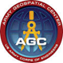

[[Overview]]

= Testbed 15 Overview

[big red yellow-background]*Research and Rapid Prototyping with the goal of enhancing and extending the OGC Standards Baseline to meet Community requirements.*

In OGC’s annual testbeds, sponsoring organisations specify interoperability requirements to address both their needs as well as gaps in the https://www.opengeospatial.org/standards[OGC Standards Baseline]. OGC staff integrate these requirements into a formal https://www.opengeospatial.org/pressroom/pressreleases/2927[Call for Participation (CFP)]. Technology providers, also known as participants, then receive cost-share support and funding to collaboratively research and rapidly develop prototype solutions. When the testbed is completed, the results are documented in https://www.opengeospatial.org/docs/er[OGC Engineering Reports]. The Engineering Reports may specify change requests to existing OGC standards, extensions to an existing standard, or even a new draft specification. These are submitted to the OGC Standards Program for discussion, consideration, and eventually Member approved consensus-based open standards and best practices.

[[Facts]]

=== Facts

The following are key facts about the OGC Testbed 15 activity.

[[Threads]]

=== Testbed 15 Key work activities (Threads)

The Testbed is organized in a number of threads. Each thread combines a number of tasks that are further defined in the Call for Participation. The threads integrate both an architectural and a thematic view, which allows keeping related work items close together and removing dependencies across threads. Click on the link if you want to read the detailed description of a Thread as provided in the CFP. In addition, short overviews are provided <<thread-summaries,here>>.

* Thread 1: Secure Data and Federated Clouds (SFC)
** https://portal.opengeospatial.org/files/?artifact_id=82290#DataCentricSecurity[Data Centric Security]
** https://portal.opengeospatial.org/files/?artifact_id=82290#FederatedCloudAnalytics[Federated Cloud Analytics]
* Thread 2: Cloud Processing and Portrayal (CPP)
** https://portal.opengeospatial.org/files/?artifact_id=82290#EOPAD[Earth Observation Process and Application Discovery]
** https://portal.opengeospatial.org/files/?artifact_id=82290#Portrayal[Open Portrayal Framework]
* Thread 3: Machine Learning and Delta Updates (MLD)
** https://portal.opengeospatial.org/files/?artifact_id=82290#MachineLearning[Machine Learning]
** https://portal.opengeospatial.org/files/?artifact_id=82290#DeltaUpdates[Delta Updates]

[[Demonstrations]]

=== Online Demonstrations

In addition to the Engineering Reports, the participants developed a suite of videos that showcase the results of the work done to meet the requirements for each Thread as defined in the CFP and modified as necessary as part of the research and prototyping activity.

The videos are available on the https://www.youtube.com/channel/UCR5YGb1pVBBFV-XNA6mA0gg[Open Geospatial YouTube channel]. If you navigate to the OGC YouTube channel, then click on the Testbed 15 playlist. Also take the opportunity to view other videos that document a variety of OGC Interoperability Initiatives.

[[Sponsoring]]

=== Sponsoring Organizations

The following OGC Member organizations sponsored OGC Testbed 15. The sponsors provided interoperability requirements, use cases, and scenarios. The also provided cost share funding as well as geospatial data as required to run the scenarios.

|===
|image:images/dstl-logo.png[width=60,height=50]  | https://www.gov.uk/government/organisations/defence-science-and-technology-laboratory[Defence Science and Technology Laboratory (Dstl)]
|image:images/esa-logo.png[width=100,height=50]  | https://www.esa.int/[European Space Agency (ESA)]
|image:images/eusc-logo.png[width=150,height=50] | https://www.satcen.europa.eu/[European Union Satellite Centre (SatCen)]
|image:images/nrcan-logo.png[width=170,height=50]| https://www.nrcan.gc.ca/home[Natural Resources Canada (NRCan)]
|   | https://www.agc.army.mil/[US Army Geospatial Center (AGC)]
|image:images/usgs-logo.png[width=120,height=50] | https://www.usgs.gov/[US Geological Survey (USGS)]
|image:images/nasa-logo.png[width=100,height=50] | https://www.nasa.gov/[US National Aeronautics and Space Administration (NASA)]
|   | https://www.nga.mil/Pages/Default.aspx[US National Geospatial-Intelligence Agency (NGA)]
|===
